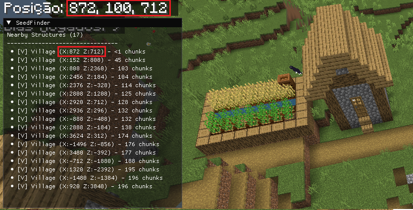
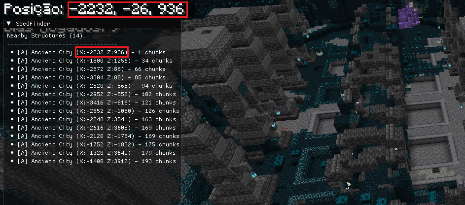

# SeedFinder For Flarial Client

## What is SeedFinder?

Is a Minecraft Bedrock Edition structure finder for [Flarial Client](https://flarial.xyz). Finds nearby villages, temples, monuments, and more — given your world seed and player position.

## Screenshots





## Compatibility 
- Minecraft Bedrock (1.18 -> Latest)

## Quick start

For users who just want to run SeedFinder without installing anything:

1. Download `SeedFinder.exe` and `SeedFinder.lua` from [releases](../../releases) 
2. Run `SeedFinder.exe`
3. Put the Lua Script in `%localappdata%/Flarial/Client/Scripts/Modules` - or just run the `SeedFinder.lua` script with [Lua](https://lua.org)
4. Enjoy!

No Python, no pip, no MinGW needed.

# For developers

## How It Works

SeedFinder has three components:

1. **C Core** (`core/`) — Structure-finding engine using [cubiomes](https://github.com/Cubitect/cubiomes) and Bedrock-specific algorithms. Compiled into `seedfinder_lib.dll`.

2. **HTTP Server** (`server/`) — Python Flask API that loads the DLL and exposes it at `http://localhost:7890`. The Lua script calls this via `network.get()`.

3. **Flarial Script** (`script/`) — Lua module that runs inside Flarial Client. Shows an ImGui overlay with found structures sorted by distance.

```
Flarial Lua Script → Flask API (localhost:7890) → seedfinder_lib.dll
   (in Minecraft)         (Python + ctypes)          (C core + cubiomes)
```

### Advanced Options

```bat
SeedFinder.exe --port 8080 --host 0.0.0.0
```

## Setup

### Prerequisites

- [MSYS2](https://www.msys2.org/) with MinGW64 toolchain (`gcc`, `g++`, `mingw32-make`)
- Python 3.11+ with Flask: `pip install flask flask-cors`
- [Flarial Client](https://flarial.xyz) installed

### Build & Run

1. Start the server (builds the DLL automatically):
   ```bat
   server\start.bat
   ```

2. Install the Lua script — see [`script/INSTALL.txt`](script/INSTALL.txt)

3. Open Minecraft with Flarial Client — SeedFinder appears in your modules

## Building the .exe

If you want to build the exe yourself:

```bat
REM 1. Build the DLL (requires MinGW)
server\start.bat

REM 2. Package into exe (requires Python + pip install pyinstaller)
python server\build_exe.py

REM 3. Output is at server\dist\SeedFinder.exe
```

## Supported Structures

- Villages
- Buried Treasures
- Trail Ruins
- Ruined Portals
- Ocean Monuments
- Jungle Temples
- Ancient Cities
- Swamp Huts
- Igloos
- Woodland Mansions
- Desert Temples

## Still without support
- Ocean Ruins
- Amethyst Geodes
- Pillager Outposts

## API Endpoints

| Endpoint | Description |
|----------|-------------|
| `GET /status` | Health check — returns `{"status": "ok"}` |
| `GET /scan?seed=&x=&z=&radius=&max=&types=` | Scan for structures. `types` is comma-separated IDs (e.g. `5` for Village, `1,5,10` for multiple) |

## Structure Type IDs

| ID | Structure | ID | Structure |
|----|-----------|----|-----------|
| 1 | Desert Pyramid | 9 | Mansion |
| 2 | Jungle Temple | 10 | Outpost |
| 3 | Swamp Hut | 11 | Ruined Portal |
| 4 | Igloo | 12 | Ruined Portal (Nether) |
| 5 | Village | 13 | Ancient City |
| 6 | Ocean Ruin | 14 | Buried Treasure |
| 7 | Shipwreck | 15 | Mineshaft |
| 8 | Monument | 16 | Desert Well |
| | | 17 | Geode |
| | | 23 | Trail Ruins |
| | | 24 | Trial Chambers |

## Contributing

Contributions are welcome!  
Bug reports, feature ideas, pull requests, and documentation improvements are all appreciated.

If you are working on a bigger change, please open an issue first so we can discuss it.

## Credits

- Structure finding algorithms: [Chunkbase](https://chunkbase.com) by Alexander Gundermann
- Biome generation: [Cubiomes](https://github.com/Cubitect/cubiomes)
- Bedrock GUI reference: [ChunkBiomesGUI](https://github.com/Nel-S/ChunkBiomes)

## License

Apache 2.0 - License
