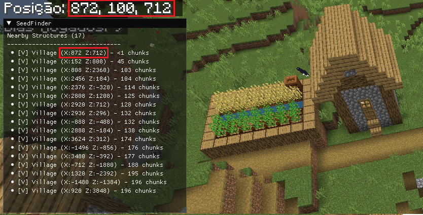
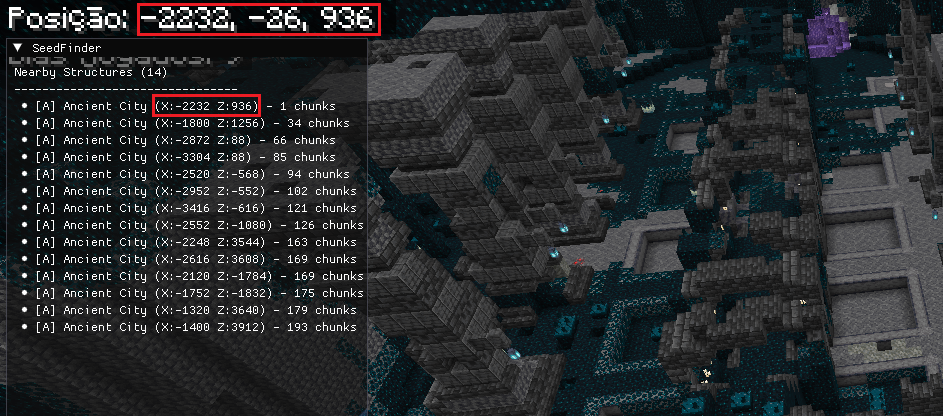

<p align="center">
  
</p>

<h1 align="center">SeedFinder</h1>

<p align="center">
  <b>Find Minecraft Bedrock structures — as a REST API, and as an overlay inside Flarial Client.</b>
</p>

<p align="center">
  
  
</p>

SeedFinder looks up nearby Minecraft **Bedrock Edition** structures — villages, buried treasure, ancient cities, ocean monuments, and so on — given a world seed and a player position. Under the hood it's a small C engine built on [cubiomes](https://github.com/Cubitect/cubiomes) plus Bedrock-specific structure math, exposed over HTTP, and hooked into an overlay module for [Flarial Client](https://flarial.xyz).

You can call the hosted API directly from any language, or drop the Lua module into Flarial and get structures listed in-game, sorted by distance, without touching a browser-based seed map.



---

## Table of contents

- [Tech stack](#tech-stack)
- [Features](#features)
- [Live example](#live-example)
- [Two ways to use SeedFinder](#two-ways-to-use-seedfinder)
- [How it works](#how-it-works)
- [API reference](#api-reference)
- [Supported structures](#supported-structures)
- [Building from source](#building-from-source)
- [Benchmarks](#benchmarks)
- [Why SeedFinder?](#why-seedfinder)
- [Roadmap](#roadmap)
- [Contributing](#contributing)
- [Credits](#credits)
- [License](#license)
- [Author](#author)

---

## Tech stack

| Component | Language | Role |
|---|---|---|
| `core/` | C (+ an experimental C++ bridge) | Wraps cubiomes and Bedrock structure math into a shared library (`seedfinder_lib.dll` / `.so`) |
| `server/` | Python (Flask) | Loads that library with `ctypes`, exposes it over HTTP |
| `script/` | Lua | Runs inside Flarial Client, calls the API, draws the ImGui overlay |

Target platform is Minecraft Bedrock Edition, 1.18 through the latest release. Most players just want the packaged Windows workflow (`SeedFinder.exe` + Lua script); the API underneath is plain HTTP and doesn't care what OS or language is calling it.

## Features

- **Native scan engine.** The actual search runs in compiled C against cubiomes, not Lua or Python, so it stays fast even at large radii — see [Benchmarks](#benchmarks) for real numbers.
- **Plain REST API.** One `GET /scan` endpoint, query-string parameters in, JSON out. No SDK, no auth.
- **A free hosted instance.** `https://mineseedfinder.vercel.app` is live right now — you can call it without building or running anything yourself.
- **In-game overlay for Flarial Client**, results sorted by distance, rendered with ImGui.
- **15 working structure types** — villages, temples, ocean structures, ancient cities, mansions, portals, and more. Full list [below](#supported-structures).
- **Multi-type queries** — ask for several structures in one request (`types=5,8,9`) instead of one call per type.
- **No dependencies for players.** The packaged `.exe` bundles the server itself; no Python or pip needed on the player's machine.
- Apache-2.0, source available, and nothing in the code sends data anywhere except the request you made.

## Live example

No install, no local server — this hits the hosted API directly:

```bash
curl "https://mineseedfinder.vercel.app/scan?seed=1234567890&x=0&z=0&radius=100&max=20&types=5"
```

```json
{
  "results": [
    { "name": "village", "x": 696, "z": 376, "distance": 48.8 }
  ]
}
```

`types=5` is Village. Try `14` for Buried Treasure, `13` for Ancient City, or a few at once with `types=5,8,9`. Full ID table is [below](#supported-structures).

## Two ways to use SeedFinder

**A. In Minecraft, through Flarial Client.** This is the packaged path most players want:

1. Download `SeedFinder.exe` and `SeedFinder.lua` from [Releases](../../releases).
2. Run `SeedFinder.exe` — it starts a local server on `http://127.0.0.1:7890`.
3. Copy `SeedFinder.lua` into `%localappdata%\Flarial\Client\Scripts\Modules`.
4. Open Minecraft with Flarial Client. SeedFinder shows up in your module list and talks to the local server automatically.

```bat
REM Optional: custom port/host
SeedFinder.exe --port 8080 --host 0.0.0.0
```



**B. As a plain HTTP API**, if you're building something of your own — a bot, a tool, a site. Point it at the hosted instance, or [run your own](#building-from-source):

```python
import requests

BASE = "https://mineseedfinder.vercel.app"

def scan(seed, x=0, z=0, radius=100, max_=20, types="5"):
    params = {"seed": seed, "x": x, "z": z, "radius": radius, "max": max_, "types": types}
    r = requests.get(f"{BASE}/scan", params=params, timeout=15)
    r.raise_for_status()
    return r.json()

for s in scan(seed=31415, radius=100, max_=50, types="5,8,9")["results"]:
    print(f"{s['name']:<14} (x={s['x']}, z={s['z']}) dist={s['distance']}")
```

```javascript
// Node 18+, no dependencies
const BASE = "https://mineseedfinder.vercel.app";

async function scan(seed, x = 0, z = 0, radius = 100, max = 20, types = "5") {
  const url = new URL("/scan", BASE);
  Object.entries({ seed, x, z, radius, max, types }).forEach(([k, v]) => url.searchParams.set(k, v));
  const res = await fetch(url, { signal: AbortSignal.timeout(15000) });
  if (!res.ok) throw new Error(`HTTP ${res.status}`);
  return res.json();
}
```

```lua
-- Inside a Flarial Client module; `network` is a Flarial global
local BASE = "http://127.0.0.1:7890" -- or https://mineseedfinder.vercel.app
local function scan(seed, x, z, radius, maxResults, types)
  local url = string.format("%s/scan?seed=%d&x=%d&z=%d&radius=%d&max=%d&types=%s",
    BASE, seed, x, z, radius, maxResults, types)
  local resp = network.get(url)
  if not resp or resp.code ~= 200 then return nil end
  return resp.body -- JSON string
end
```

## How it works

```
Flarial Lua Script  --HTTP-->  Flask server  --ctypes-->  seedfinder_lib (.so / .dll)  -->  cubiomes
   (in Minecraft)               (port 7890)                  (compiled from core/)
```

1. **C core** (`core/`) — `seedfinder_wrapper.c` links cubiomes statically and implements `seedfinder_scan()`. For each requested structure type it walks the relevant grid regions around the player within `radius`, checks biome viability, computes distance, sorts, caps at `max`, and returns a hand-built JSON string across the ABI boundary (freed afterward with `seedfinder_free_result`).
2. **HTTP server** (`server/`) — a single Flask app package (`server/app/`) loads that shared library and exposes `/status` and `/scan`. One codebase serves every deployment: `server/index.py` is the WSGI entry (Vercel root directory is `server/`), the same file runs locally on Windows and Linux via `server/start.bat` / `server/start.sh`, and it's what gets frozen into `SeedFinder.exe` by `server/build_exe.py`.
3. **Flarial script** (`script/SeedFinder.lua`) — polls `/status`, calls `/scan` with the player's live coordinates, and draws the results in an ImGui panel with a name-to-icon lookup.

There's also an experimental fourth path in `core/SeedFinderBridge.cpp` / `.h`: a direct Lua↔C bridge meant to be compiled straight into the Flarial Client DLL, cutting out the HTTP hop entirely. It's set up in `CMakeLists.txt` but the shipped Lua script doesn't use it yet — see [Roadmap](#roadmap).

## API reference

### `GET /status`

```json
{"status": "ok"}
```

### `GET /scan`

| Param | Type | Default | Notes |
|---|---|---|---|
| `seed` | integer | `0` | World seed. Negative values are accepted and folded into an unsigned 64-bit seed, the way Minecraft represents seeds internally. |
| `x` | float | `0` | Player X block position. |
| `z` | float | `0` | Player Z block position. |
| `radius` | integer | `100` | Search radius in **chunks**. |
| `max` | integer | `20` | Max results returned, sorted by distance ascending. |
| `types` | string | `"5"` | Comma-separated [structure IDs](#supported-structures), e.g. `"5,8,9"`. |

```json
{
  "results": [
    { "name": "village", "x": 696, "z": 376, "distance": 48.8 }
  ]
}
```

`distance` is in chunks, rounded to one decimal.

Error responses:

```jsonc
// 400 — bad value, e.g. seed=abc
{ "error": "Invalid parameter: invalid literal for int() with base 10: 'abc'" }

// 503 — native library failed to load (Vercel only, if the build didn't ship the .so)
{ "error": "SeedFinder native library (.so) not loaded on this server.", "results": [] }
```

All deployments run the same app package, so behavior is identical everywhere: `radius` and `max` are clamped to `1000`, and a `missing_or_invalid` array lists any params that had to be defaulted (e.g. a stray `radius=50000` is capped rather than let through).

The local server also serves a tiny HTML form at `/` if you'd rather click through a request than type a `curl` command.

## Supported structures

Confirmed by calling `/scan` for every ID against a real seed at a large radius:

| ID | Structure | Status | ID | Structure | Status |
|----|-----------|:---:|----|-----------|:---:|
| 1 | Desert Pyramid | ✅ | 13 | Ancient City | ✅ |
| 2 | Jungle Temple | ✅ | 14 | Buried Treasure | ✅ |
| 3 | Swamp Hut | ✅ | 15 | Mineshaft | ✅ |
| 4 | Igloo | ✅ | 16 | Desert Well | ⚠️ not supported |
| 5 | Village | ✅ | 17 | Amethyst Geode | ⚠️ not supported |
| 6 | Ocean Ruin | ⚠️ not supported | 23 | Trail Ruins | ✅ |
| 7 | Shipwreck | ✅ | 24 | Trial Chambers | ✅ |
| 8 | Ocean Monument | ✅ | | | |
| 9 | Woodland Mansion | ✅ | | | |
| 10 | Pillager Outpost | ⚠️ not supported | | | |
| 11 | Ruined Portal | ✅ | | | |
| 12 | Ruined Portal (Nether) | ✅ | | | |

15 of the 19 listed IDs are supported. IDs `6` (Ocean Ruin), `10` (Pillager Outpost), `16` (Desert Well), and `17` (Amethyst Geode) aren't available yet — see [Roadmap](#roadmap).

Bastion Remnant, Nether Fortress, and End City aren't exposed under any ID yet, though their structure configs already exist in the engine — see [Roadmap](#roadmap).

## Building from source

**Prerequisites**

- Windows: [MSYS2](https://www.msys2.org/) with the MinGW64 toolchain (`gcc`, `g++`, `mingw32-make`)
- Linux: `cmake`, `make`, `gcc` (e.g. `sudo apt install cmake build-essential` on Debian/Ubuntu)
- Python 3.11+ with `pip install flask flask-cors`
- [Flarial Client](https://flarial.xyz), only needed to actually load the Lua module in-game

**Build + run**

```bash
# Windows
server\start.bat

# Linux
server/start.sh
```

Both scripts build `seedfinder_lib` via CMake into `build_server/`, then start the Flask server on port `7890`.

**Package into a Windows `.exe`**:

```bat
pip install pyinstaller
python server\build_exe.py
REM Output: server\dist\SeedFinder.exe
```

**Install the Lua module** — see [`script/INSTALL.txt`](script/INSTALL.txt).

## Benchmarks

I ran these myself against the real compiled engine, not estimated:

- Binary tested: `build_server/seedfinder_lib.so`, built from this repo's own source, served through `server/index.py` (Flask's built-in dev server, same as the project ships — no custom harness).
- Timed with `curl -w "%{time_total}"` against `localhost`, so this is engine + Flask overhead, network latency excluded.
- 5 requests per scenario, average shown. There's no caching in the code, so every request does a full scan.
- Environment: single-vCPU Intel Xeon @ 2.10 GHz container, Ubuntu 24.04.4, Python 3.12.3, Flask 3.1.3, measured July 4, 2026. That's a modest single core — expect quicker results on a real desktop. The server is also single-threaded by default (Flask's dev server), so it won't spread a scan across multiple cores regardless of what's available.

| Scenario | Radius | Types | Results | Avg. time |
|---|---:|---|---:|---:|
| Village | 100 | `5` | 1 | ~4.6 ms |
| Buried Treasure | 200 | `14` | 20 (capped) | ~152.6 ms |
| Ancient City | 500 | `13` | 20 (capped) | ~42.9 ms |
| Village + Monument + Mansion | 300 | `5,8,9` | 50 (capped) | ~132.6 ms |
| 5 types combined | 1000 | `5,14,13,9,10` | 1000 (capped) | ~3.72 s |

The interesting part: cost tracks how often a structure's grid repeats, not just the radius. Buried Treasure has a small region spacing and gets checked almost every chunk pair, so radius 200 (152.6 ms) actually costs more than Ancient City at radius 500 (42.9 ms), since Ancient City's grid is much sparser. If you're polling this from something latency-sensitive — an in-game overlay, say — smaller radii and fewer combined types will feel a lot snappier than cranking both up.

## Why SeedFinder?

Compared to opening a browser-based seed map like Chunkbase mid-game: same underlying structure math (it credits and builds on Chunkbase's ported algorithms), but the results land inside Flarial instead of needing you to alt-tab out.

Compared to a Lua- or Python-only structure finder: the search itself runs in compiled C against cubiomes, which is the whole reason a radius-1000, 5-type scan finishes in a few seconds instead of a lot longer.

Compared to needing your own backend: the hosted API is free and public, so a small tool or bot can integrate without anyone standing up infrastructure for it.

And the honest tradeoff: this is a Bedrock-specific, Flarial-specific project with a Windows-first packaged path. If you want Java Edition seed finding, or a fully cross-platform native client rather than an HTTP API, [ChunkBiomesGUI](https://github.com/Nel-S/ChunkBiomes) or [cubiomes](https://github.com/Cubitect/cubiomes) directly might suit you better — SeedFinder is really this project's packaging of that same engine for Flarial users and API consumers.

## Roadmap

- **Direct Lua↔C bridge** (`core/SeedFinderBridge.cpp`) — compile the engine straight into the Flarial Client DLL and expose `seedfinder_bridge.scanStructures(...)` to Lua, removing the HTTP hop for the in-game path.
- **SeedCracker** — listed as "coming soon" in the hosted API's navigation. Cracking a seed from observed structures, rather than scanning from a known one.
- **Ocean Ruin, Pillager Outpost, Amethyst Geode, and Desert Well support** — IDs `6`, `10`, `17`, and `16` are reserved but not available yet.
- **Nether/End structures** — Bastion, Fortress, and End City configs already exist internally but aren't wired into the public `types` list yet.

## Contributing

Bug reports, feature ideas, pull requests, and doc fixes are all welcome. For anything bigger, open an issue first so we can talk through the approach before you sink time into it.

## Credits

- Structure-finding algorithms: [Chunkbase](https://chunkbase.com) by Alexander Gundermann
- Biome generation: [Cubiomes](https://github.com/Cubitect/cubiomes) (Cubitect, MIT License)
- Bedrock GUI reference: [ChunkBiomesGUI](https://github.com/Nel-S/ChunkBiomes)

## License

[Apache License 2.0](LICENSE)

## Author

[zebedelu](https://github.com/zebedelu)
